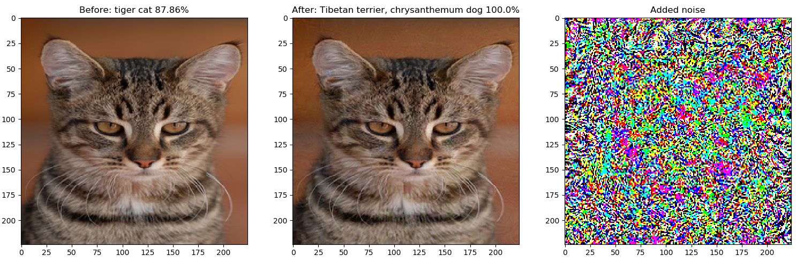

## Fast Gradient Sign Method

This is an implementation of the Fast Gradient Sign Method for adversarial image generation in PyTorch 1.0.
Supports both targeted and untargeted attacks (see example.py for full example).

